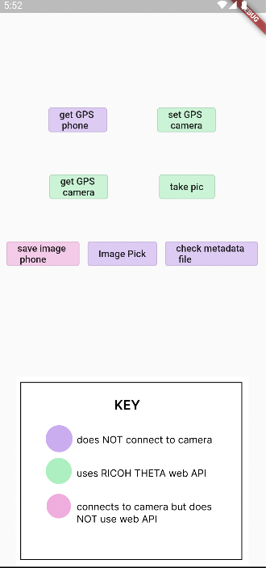
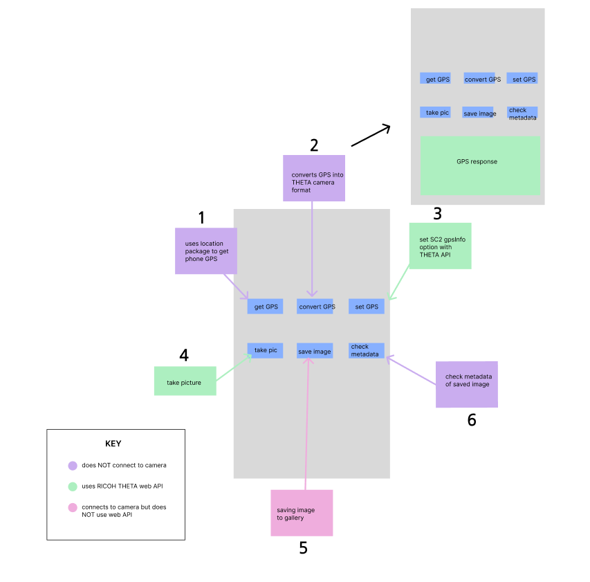

# 13. SC2 GPS API Tutorial

Current status of the app:

This project illustrates how to acquire GPS information from Android devices and record the information into the RICOH THETA image files. This app focuses on the RICOH THETA V. It should also work with the RICOH THETA Z1 model. 

[DateTime](https://www.kindacode.com/snippet/dart-convert-timestamp-to-datetime-and-vice-versa/)