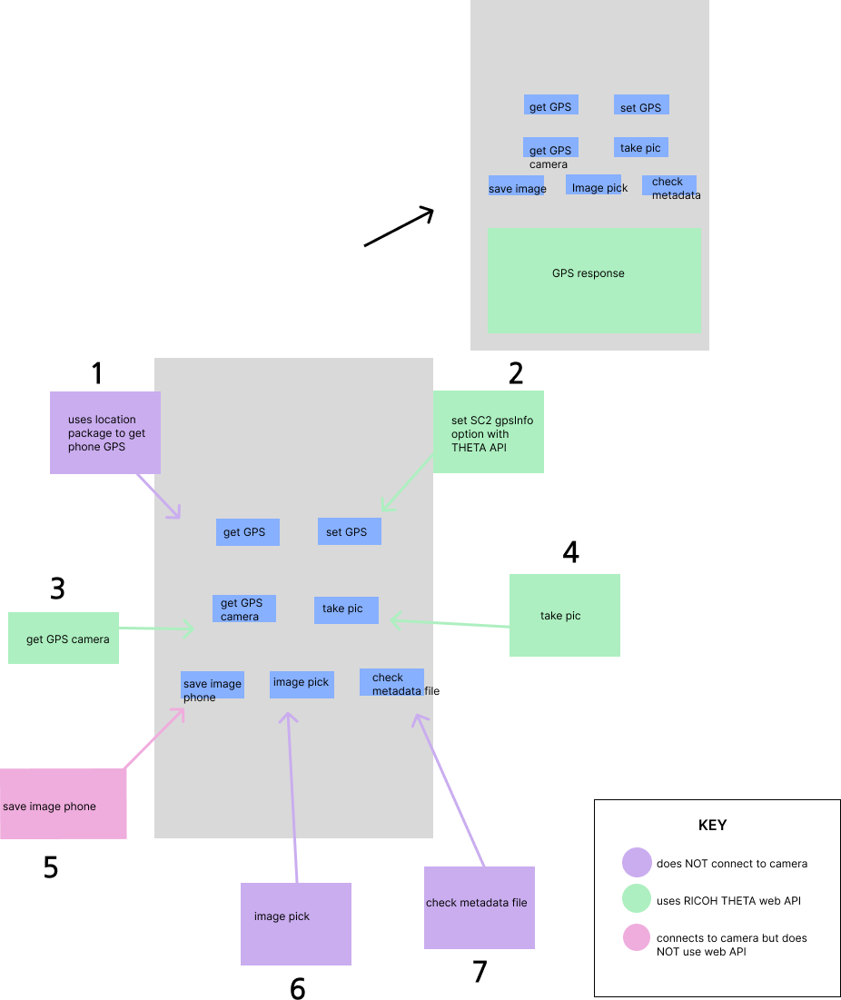

# 13. SC2 GPS API Tutorial

This project illustrates how to acquire GPS information from Android devices and record the information into the RICOH THETA image files. This app focuses on the RICOH THETA V. It should also work with the RICOH THETA Z1 model. 



Screenshot of the app:


## Time format conversion

To convert the time, this project uses [DateTime](https://www.kindacode.com/snippet/dart-convert-timestamp-to-datetime-and-vice-versa/). 

```dart
DateTime date =
          DateTime.fromMicrosecondsSinceEpoch(state.time.toInt() * 1000);
      String month = date.month.toString();
      if (date.month < 10) {
        month = "0${date.month}";
      }
```

## RICOH THETA API

The project uses the [RICOH THETA API gpsInfo option](https://api.ricoh/docs/theta-web-api-v2.1/options/gps_info/) to set the GPS information for the camera. The `gpsInfo` option has parameters for latitude, longitude, altitude, date and datum.

```dart
     var bodyMap = {
        'name': 'camera.setOptions',
        'parameters': {
          'options': {
            'gpsInfo': {
              "lat": state.latitude,
              "lng": state.longitude,
              "_altitude": state.altitude,
              "_dateTimeZone": "${date.year}:05:18 01:04:29+08:00",
              "_datum": "WGS84"
            }
          }
        }
      };
```

On the physical device, the user has to wait for a couple of moments for the GPS location to take place.