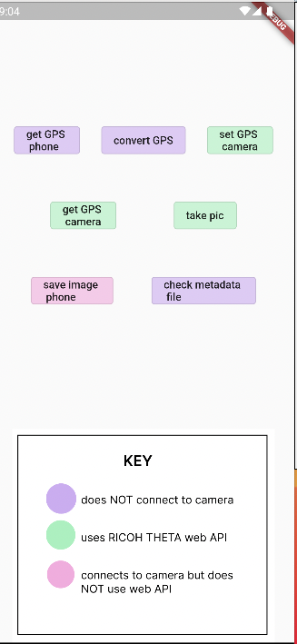

# 13. SC2 GPS API Tutorial

Current status of the app:

This project illustrates how to acquire GPS information from Android and iOS devices and record the information into the RICOH THETA image files. The example focuses on the RICOH THETA SC2, the lowest-cost model. It should also work with the RICOH THETA V, Z1 and X models. However, as the RICOH THETA X has built-in GPS, the technique explained in this tutorial is not recommended for the RICOH THETA X.

It does not appear that the RICOH THETA SC2 supports the [camera._getMetadata ](https://api.ricoh/docs/theta-web-api-v2.1/commands/camera._get_metadata/) API command.  This tutorial shows a workaround, which involves downloading the SC2 image from the camera to the local mobile device and then using local Flutter packages.

[DateTime](https://www.kindacode.com/snippet/dart-convert-timestamp-to-datetime-and-vice-versa/)